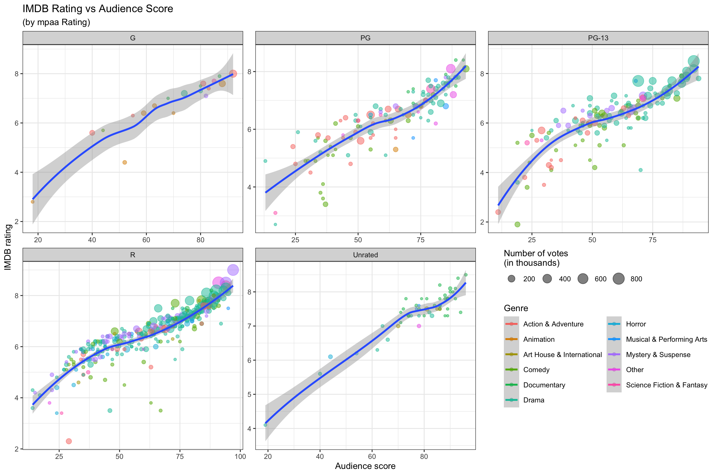

<style>
.forceBreak { -webkit-column-break-after: always; break-after: column; }
</style>

```{r, message=FALSE, warning=FALSE, include=FALSE}
options(
  htmltools.dir.version = FALSE, # for blogdown
  width = 80,
  tibble.width = 80
)

knitr::opts_chunk$set(
  fig.align = "center"
)

htmltools::tagList(rmarkdown::html_dependency_font_awesome())

library(dplyr)
library(purrr)
library(tidyr)
library(magrittr)
library(ggplot2)
library(gapminder)
library(shiny)
library(ggthemes)
```


## Plan for this Week {.build}

1. Some quick tips

2. [`ggplot2`](https://r4ds.had.co.nz/data-visualisation.html)


# <span style="color:orange">First, some quick tips</span>

## Useful quick tips {.smaller .build}

### <span style="color:cornflowerblue">R Comments</span>
Write comments in your code after `#` (in `Rmd` docs `#` only works within chunks)
```{r eval=F}
my.vec1 <- c("some","word") # this is a comment
my.vec2 <- c("some","other","word") # this is also a comment
```

### <span style="color:cornflowerblue">Saving R objects</span>
```{r eval=F}
 save(list=c("my.vec1","my.vec2"),file = "MyCharVecs.RData")
```

### <span style="color:cornflowerblue">Loading objects into R</span>
```{r eval=F}
load("MyCharVecs.RData")
```

Where are these files being saved to and loaded from?


## Useful quick tips {.smaller .build}

### <span style="color:cornflowerblue">Working Directory</span>

R saves and looks for files in your current *working directory*. <span style="color:forestgreen">To see what it is, use:</span>
```{r}
getwd()
```

You can also set your session to a working directory
```{r, eval=FALSE}
setwd("C:/Users/dtr/theDirectory")
```

<span style="color:cornflowerblue">*Working dirs in R Markdown docs are set automatically to where the `Rmd` file is stored*</span>

## Useful quick tips {.smaller .build}

### <span style="color:cornflowerblue">Managing Files</span> 

Give each project (e.g., a homework) its own folder. Here is my system:

* Every class or project has its own folder

* Each assignment or task has a folder inside that, which is the working directory for that item.

* `.Rmd` and `.R` files are named clearly and completely

For example, this presentation is located and named this:

`Lectures/Lectures_Week04/DataVisualization02.Rmd`

<span style="color:cornflowerblue">Use whatever system you want, but be consistent!</span>


# <span style="color:orange">Grammar of Graphics</span>

## The Grammar of Graphics  {.smaller .build}

- Visualisation concept created by Wilkinson (1999)
    - defines basic elements of a statistical graphic 

- Adapted for R by Wickham (2009)
    - consistent and compact syntax to describe statistical graphics
    - highly modular as it breaks up graphs into semantic components 

- It's not a guide to which graph to use and how to best convey your data


## Terminology  {.smaller .build}

A statistical graphic is a...

- mapping of **data**
- which may be **statistically transformed** (summarised, log-transformed, etc.)
- to **aesthetic attributes** (color, size, xy-position, etc.)
- using **geometric objects** (points, lines, bars, etc.)
- and mapped onto a specific **facet** and **coordinate system**


# <span style="color:orange">Plotting in ggplot2 </span>

## ggplot2  {.smaller .build}

- ggplot2 is based on the grammar of graphics, which tries to take the good parts of <span style="color:cornflowerblue">*base*</span> and <span style="color:cornflowerblue">*lattice*</span> graphics and none of the bad parts

- It takes care of many of the fiddly details that make plotting a hassle (like drawing legends or faceting (e.g., `legend`, `mfrow`, `mfcol`, `layout`)

- Powerful model for graphical representation of data, simplifies making complex multi-layered visualizations


## Anatomy of a `ggplot` {.smaller .build}

### <span style="color:cornflowerblue">`ggplot2` package build plots by **layers**</span>

<div style="color:orange">
- *data* `ggplot`

- *geometry:* `geom_point`, `geom_line`, `geom_smooth`, `geom_bar`, ...

- *titles* and *axis labels*: `ggtitle`, `lab`, `xlab`, `ylab`

- *themes*: `theme`, `theme_bw`, `theme_classic`, ...

- *facets*: `facet_wrap` and `facet_grid`

</div>

**Layers** are separated by a `+` sign.

## Anatomy of a `ggplot` {.smaller .build}

### <span style="color:cornflowerblue">`ggplot2` defines **aesthetics** within each layer</span>

<span style="color:orange"> **Aesthetics**</span>, to control the appearance of the layers (e.g., point/line colors or transparency -- `alpha` between 0 and 1)

* `x`, `y`: $x$ and $y$ coordinate values to use
* `color`: set color of elements based on some data value
* `group`: describe which points are conceptually grouped together for the plot (often used with lines)
* `size`: set size of points/lines based on some data value
* `alpha`: set transparency based on some data value

## Anatomy of a `ggplot` {.smaller .build}

### <span style="color:cornflowerblue">**Aesthetics:** mappings vs settings</span>

### <span style="color:orange">Aesthetic Settings:</span>

- These *don't depend on the data* and can be specified directly on the layers

- Some are: `color`, `size`, `linetype`, `shape`, `fill`, and `alpha` 

- See the [`ggplot2` documentation](http://docs.ggplot2.org/current/vignettes/ggplot2-specs.html) 

### <span style="color:orange">Aesthetic Mappings:</span>

- Arguments inside `aes()` that *depend on the data*, e.g. `geom_point(aes(color = continent))`
- `aes()` in the `ggplot()` layer gives overall aesthetics to use in other layers
- `aes()` can be changed on individual layers

### <span style="color:orange">Now, let's build a ggplot by steps</span>


## Making a `ggplot` {.smaller}


```{r}
data(gapminder)
China <- gapminder[gapminder$country == "China",]
head(China, 4)
```

## Making a `ggplot`: the base plot {.smaller}

### <span style="color:cornflowerblue">... the **data** and global **aesthetics**</span>

<div class="columns-2">
```{r,  eval=FALSE}
ggplot(data = China, 
       aes(x = year, y = lifeExp))
```

<p class="forceBreak"></p>
```{r,  echo=FALSE, fig.height=3, fig.width=3.5}
ggplot(data = China, aes(x = year, y = lifeExp))
```
</div>
 
## Making a `ggplot`: the geometry {.smaller}

### <span style="color:cornflowerblue">... including  a *geom* (a scatterplot)</span>

<div class="columns-2">
```{r,  eval=FALSE}
ggplot(data = China, 
       aes(x = year, y = lifeExp)) +
    geom_point()
```

<p class="forceBreak"></p>
```{r,  echo=FALSE, fig.height=3, fig.width=3.5}
ggplot(data = China, aes(x = year, y = lifeExp)) +
    geom_point()
```
</div>

## Making a `ggplot`: some aesthetics {.smaller}

### <span style="color:cornflowerblue">... adding *color* and changing the *size*</span>

<div class="columns-2">
```{r,  eval=FALSE}
ggplot(data = China, 
       aes(x = year, y = lifeExp)) +
    geom_point(color = "red", size = 3)
```

<p class="forceBreak"></p>
```{r,  echo=FALSE, fig.height=3, fig.width=3.5}
ggplot(data = China, aes(x = year, y = lifeExp)) +
    geom_point(color = "red", size = 3)
```
</div>


## Making a `ggplot`: axis labels {.smaller}

### <span style="color:cornflowerblue">... adding the *x-label*</span>

<div class="columns-2">
```{r,  eval=FALSE}
ggplot(data = China, 
       aes(x = year, y = lifeExp)) +
  geom_point(color = "red", size = 3) +
  xlab("Year")
```

<p class="forceBreak"></p>
```{r,  echo=FALSE, fig.height=3, fig.width=3.5}
ggplot(data = China, 
       aes(x = year, y = lifeExp)) +
  geom_point(color = "red", size = 3) +
  xlab("Year")
```
</div>

## Making a `ggplot`: axis labels {.smaller}

### <span style="color:cornflowerblue">... adding the *y-label*</span>

<div class="columns-2">
```{r,  eval=FALSE}
ggplot(data = China, 
       aes(x = year, y = lifeExp)) +
  geom_point(color = "red", size = 3) +
  xlab("Year") + ylab("Life Expectancy")
```

<p class="forceBreak"></p>
```{r,  echo=FALSE, fig.height=3, fig.width=3.5}
ggplot(data = China, 
       aes(x = year, y = lifeExp)) +
  geom_point(color = "red", size = 3) +
  xlab("Year") + ylab("Life Expectancy")
```
</div>


## Making a `ggplot`: title {.smaller}

### <span style="color:cornflowerblue">... adding the *title*</span>

<div class="columns-2">
```{r,  eval=FALSE}
ggplot(data = China, 
       aes(x = year, y = lifeExp)) +
  geom_point(color = "red", size = 3) +
  xlab("Year") + ylab("Life Expectancy") +
  ggtitle("Life expectancy in China")
```

<p class="forceBreak"></p>
```{r,  echo=FALSE, fig.height=3, fig.width=3.5}
ggplot(data = China, 
       aes(x = year, y = lifeExp)) +
  geom_point(color = "red", size = 3) +
  xlab("Year") + ylab("Life Expectancy") +
  ggtitle("Life expectancy in China")
```
</div>

## Making a `ggplot`: theme {.smaller}

### <span style="color:cornflowerblue">... choosing a *theme*</span>

<div class="columns-2">
```{r,  eval=FALSE}
ggplot(data = China, 
       aes(x = year, y = lifeExp)) +
  geom_point(color = "red", size = 3) +
  xlab("Year") + ylab("Life Expectancy") +
  ggtitle("Life expectancy in China")  +
  theme_bw()
```

<p class="forceBreak"></p>
```{r,  echo=FALSE, fig.height=3, fig.width=3.5}
ggplot(data = China, 
       aes(x = year, y = lifeExp)) +
  geom_point(color = "red", size = 3) +
  xlab("Year") + ylab("Life Expectancy") +
  ggtitle("Life expectancy in China") +
  theme_bw()
```
</div>

## Making a `ggplot`: theme {.smaller}

### <span style="color:cornflowerblue">... changing the *text size*</span>

<div class="columns-2">
```{r,  eval=FALSE}
ggplot(data = China, 
       aes(x = year, y = lifeExp)) +
  geom_point(color = "red", size = 3) +
  xlab("Year") + ylab("Life Expectancy") +
  ggtitle("Life expectancy in China")  +
  theme_bw(base_size = 14)
```

<p class="forceBreak"></p>
```{r,  echo=FALSE, fig.height=3, fig.width=3.5}
ggplot(data = China, 
       aes(x = year, y = lifeExp)) +
  geom_point(color = "red", size = 3) +
  xlab("Year") + ylab("Life Expectancy") +
  ggtitle("Life expectancy in China") +
  theme_bw(base_size = 14)
```
</div>


## Making a `ggplot` {.smaller .build}

### <span style="color:cornflowerblue">... what if we want to see all countries?</span>

<div class="columns-2">
```{r,  eval=FALSE}
ggplot(data = gapminder, 
       aes(x = year, y = lifeExp)) +
  geom_point(color = "red", size = 3) +
  xlab("Year") + ylab("Life Expectancy") +
  ggtitle("Life expectancy in China")  +
  theme_bw(base_size = 14)
```

### <span style="color:orange">Oooops, this did not work!!! </span>

Can't separate countries.

<p class="forceBreak"></p>
```{r,  echo=FALSE, fig.height=3, fig.width=3.5}
ggplot(data = gapminder, 
       aes(x = year, y = lifeExp)) +
  geom_point(color = "red", size = 3) +
  xlab("Year") + ylab("Life Expectancy") +
  ggtitle("Life expectancy in China") +
  theme_bw(base_size = 14)
```
</div>

## Making a `ggplot` {.smaller .build}

### <span style="color:cornflowerblue">... maybe use lines instead of points?</span>

<div class="columns-2">
```{r,  eval=FALSE}
ggplot(data = gapminder, 
       aes(x = year, y = lifeExp)) +
  geom_line(color = "red") +
  xlab("Year") + ylab("Life Expectancy") +
  ggtitle("Life expectancy in China")  +
  theme_bw(base_size = 14)
```

### <span style="color:orange">`ggplot` can't tell them apart, need to tell it how!</span>

<p class="forceBreak"></p>
```{r,  echo=FALSE, fig.height=3, fig.width=3.5}
ggplot(data = gapminder, 
       aes(x = year, y = lifeExp)) +
  geom_line(color = "red") +
  xlab("Year") + ylab("Life Expectancy") +
  ggtitle("Life expectancy in China") +
  theme_bw(base_size = 14)
```
</div>

## Making a `ggplot`: `group` aesthetic {.smaller .build}

### <span style="color:cornflowerblue">... tell `ggplot` to group by country</span>

<div class="columns-2">
```{r,  eval=FALSE}
ggplot(data = gapminder, 
       aes(x = year, y = lifeExp, 
           group = country)) +
  geom_line(color = "red") +
  xlab("Year") + ylab("Life Expectancy") +
  ggtitle("Life expectancy in China")  +
  theme_bw(base_size = 14)
```

### <span style="color:orange">still hard to see patterns...</span>

- Let's also make the lines narrower

- Are there patterns by continent? 

<p class="forceBreak"></p>
```{r,  echo=FALSE, fig.height=3, fig.width=3.5}
ggplot(data = gapminder, 
       aes(x = year, y = lifeExp, 
           group = country)) +
  geom_line(color = "red", size = 0.5) +
  xlab("Year") + ylab("Life Expectancy") +
  ggtitle("Life expectancy in China")  +
  theme_bw(base_size = 14)
```
</div>

## Making a `ggplot`: `color` aesthetic {.smaller .build}

### <span style="color:cornflowerblue">... tell `ggplot` to color by continent</span>

<div class="columns-2">
```{r,  eval=FALSE}
ggplot(data = gapminder, 
       aes(x = year, y = lifeExp, 
           group = country,
           colour = continent)) +
  geom_line(color = "red",
            lwd = 0.3) +
  xlab("Year") + ylab("Life Expectancy") +
  ggtitle("Life expectancy over time")  +
  theme_bw(base_size = 14)
```

### <span style="color:orange">color didn't change, why?</span>

<p class="forceBreak"></p>
```{r,  echo=FALSE, fig.height=3, fig.width=3.5}
ggplot(data = gapminder, 
       aes(x = year, y = lifeExp, 
           group = country,
           colour = continent)) +
  geom_line(color = "red",
            lwd = 0.3) +
  xlab("Year") + ylab("Life Expectancy") +
  ggtitle("Life expectancy over time")  +
  theme_bw(base_size = 14)
```
</div>

## Making a `ggplot`: `color` aesthetic {.smaller .build}

### <span style="color:cornflowerblue">... tell `ggplot` to color by continent</span>

<div class="columns-2">
```{r,  eval=FALSE}
ggplot(data = gapminder, 
       aes(x = year, y = lifeExp, 
           group = country,
           color = continent)) +
  geom_line(lwd = 0.3) +
  xlab("Year") + ylab("Life Expectancy") +
  ggtitle("Life expectancy over time")  +
  theme_bw(base_size = 8)
```

### <span style="color:orange">ok better, but crammed</span>

- There are clear paterns by continent, but hard to see here
- Let's get separate figures by continent

<p class="forceBreak"></p>
```{r,  echo=FALSE, fig.height=3, fig.width=3.5}
ggplot(data = gapminder, 
       aes(x = year, y = lifeExp, 
           group = country,
           color = continent)) +
  geom_line(lwd = 0.3) +
  xlab("Year") + ylab("Life Expectancy") +
  ggtitle("Life expectancy over time")  +
  theme_bw(base_size = 8)
```
</div>

## Making a `ggplot`: facets {.smaller}

```{r,  eval=FALSE, echo=TRUE, fig.height=4, fig.width=4.5}
ggplot(data = gapminder, 
       aes(x = year, y = lifeExp, 
           group = country, 
           color = continent)) +
  geom_line(lwd = 0.3) +
  xlab("Year") + ylab("Life Expectancy") +
  ggtitle("Life expectancy over time")  +
  theme_bw(base_size = 8) + 
  facet_wrap(continent~.)
```


## Making a `ggplot`: facets {.smaller}

```{r,  eval=TRUE, echo = FALSE, fig.height=5, fig.width=6}
ggplot(data = gapminder, 
       aes(x = year, y = lifeExp, 
           group = country, 
           color = continent)) +
  geom_line(lwd = 0.3) +
  xlab("Year") + ylab("Life Expectancy") +
  ggtitle("Life expectancy over time")  +
  theme_bw(base_size = 8) + 
  facet_wrap(~ continent)
```

## Making a `ggplot`: legend options {.smaller}

### <span style="color:orange">... change legend position</span>

```{r,  eval=FALSE, echo=TRUE, fig.height=4, fig.width=4.5}
ggplot(data = gapminder, 
       aes(x = year, y = lifeExp, 
           group = country, 
           color = continent)) +
  geom_line(lwd = 0.3) +
  xlab("Year") + ylab("Life Expectancy") +
  ggtitle("Life expectancy over time")  +
  theme_bw(base_size = 8) + 
  facet_wrap(~ continent) +
  theme(legend.position = c(0.8, 0.25))
```


## Making a `ggplot`: legend options {.smaller}

```{r,  eval=TRUE, echo = FALSE, fig.height=5, fig.width=6}
ggplot(data = gapminder, 
       aes(x = year, y = lifeExp, 
           group = country, 
           color = continent)) +
  geom_line(lwd = 0.3) +
  xlab("Year") + ylab("Life Expectancy") +
  ggtitle("Life expectancy over time")  +
  theme_bw(base_size = 9) + 
  facet_wrap(~ continent) +
  theme(legend.position = c(0.8, 0.25))
```

#### <span style="color:orange">... changed legend position, but don't really need it</span>

## Making a `ggplot`: legend options {.smaller}

### <span style="color:orange">... remove legend</span>

```{r,  eval=FALSE, echo=TRUE, fig.height=4, fig.width=4.5}
ggplot(data = gapminder, 
       aes(x = year, y = lifeExp, 
           group = country, 
           color = continent)) +
  geom_line(lwd = 0.3) +
  xlab("Year") + ylab("Life Expectancy") +
  ggtitle("Life expectancy over time")  +
  theme_bw(base_size = 8) + 
  facet_wrap(~ continent) +
  theme(legend.position = c(0.8, 0.25))
```


## Making a `ggplot`: legend options {.smaller}

```{r,  eval=TRUE, echo = FALSE, fig.height=5, fig.width=6}
ggplot(data = gapminder, 
       aes(x = year, y = lifeExp, 
           group = country, 
           color = continent)) +
  geom_line(lwd = 0.3) +
  xlab("Year") + ylab("Life Expectancy") +
  ggtitle("Life expectancy over time")  +
  theme_bw(base_size = 9) + 
  facet_wrap(~ continent) +
  theme(legend.position = "none")
```

#### <span style="color:orange">`legend.position = "none"`</span>


## Making a `ggplot`: more on faceting {.smaller}

### <span style="color:orange">... alternative faceting</span>

```{r,  eval=FALSE, echo=TRUE, fig.height=3, fig.width=8}
ggplot(data = gapminder, 
       aes(x = year, y = lifeExp, 
           group = country, 
           color = continent)) +
  geom_line(lwd = 0.3) +
  xlab("Year") + ylab("Life Expectancy") +
  ggtitle("Life expectancy over time")  +
  theme_bw(base_size = 8) + 
  facet_grid(cols = vars(continent)) +
  theme(legend.position = "none")
```


## Making a `ggplot`: more on faceting {.smaller}

### <span style="color:orange">... alternative faceting</span>
```{r,  eval=TRUE, echo = FALSE, fig.height=2.5, fig.width=8}
ggplot(data = gapminder, 
       aes(x = year, y = lifeExp, 
           group = country, 
           color = continent)) +
  geom_line(lwd = 0.3) +
  xlab("Year") + ylab("Life Expectancy") +
  ggtitle("Life expectancy over time")  +
  theme_bw(base_size = 8) + 
  facet_grid(cols = vars(continent)) +
  theme(legend.position = "none")
```

#### <span style="color:orange">`facet_grid` by `cols`</span>


## Making a `ggplot`: adding a `smooth` {.smaller}

### <span style="color:orange">... get averages by continent</span>
```{r,  eval=FALSE, echo=TRUE, fig.height=3, fig.width=8}
ggplot(data = gapminder, 
       aes(x = year, y = lifeExp, group = country)) +
  geom_line(lwd=0.1, alpha=0.5) +
  geom_line(stat = "smooth", method = "loess",
            aes(group = continent, color = continent)) +
  xlab("Year") + ylab("Life Expectancy") +
  ggtitle("Life expectancy over time")  +
  theme_bw(base_size = 8) + 
  facet_grid(cols = vars(continent)) +
  theme(legend.position = "none")
```

#### <span style="color:orange">the command `alpha` modifies the transparency</span>

## Making a `ggplot`: adding a `smooth` {.smaller}

### <span style="color:orange">... get averages by continent</span>
```{r,  eval=TRUE, echo = FALSE, fig.height=2.5, fig.width=8}
ggplot(data = gapminder, 
       aes(x = year, y = lifeExp, 
           group = country)) +
  geom_line(lwd=0.1, alpha=0.5) +
  geom_line(stat = "smooth", method = "loess", #<<
            aes(group = continent, color = continent)) +
  xlab("Year") + ylab("Life Expectancy") +
  ggtitle("Life expectancy over time")  +
  theme_bw(base_size = 8) + 
  facet_grid(cols = vars(continent)) +
  theme(legend.position = "none")
```


## Making a `ggplot`: stored ggplots {.smaller}

### <span style="color:orange">... assign a `ggplot` object to a name</span>

```{r,  eval=TRUE, echo=TRUE, fig.height=3, fig.width=8}
my.fist.plot <- ggplot(data = gapminder, 
       aes(x = year, y = lifeExp, 
           group = country)) +
  geom_line(lwd=0.1, alpha=0.5) +
  geom_line(stat = "smooth", method = "loess", #<<
            aes(group = continent, color = continent)) +
  xlab("Year") + ylab("Life Expectancy") +
  ggtitle("Life expectancy over time")  +
  theme_bw(base_size = 8) + 
  facet_grid(cols = vars(continent)) +
  theme(legend.position = "none")
```

<div style="color:cornflowerblue">
- This plot won't be displayed until you type in the object name
- You can also take the object and add more layers!!
</div>

## Making a `ggplot`: stored ggplots {.smaller}

### <span style="color:orange">... show the stored plot</span>

```{r,  eval=TRUE, echo=TRUE, fig.height=3, fig.width=8}
my.fist.plot
```

## Making a `ggplot`: stored ggplots {.smaller}

### <span style="color:orange">... adding layers to a stored plot</span>

```{r,  eval=TRUE, echo=TRUE, fig.height=3, fig.width=8}
my.fist.plot + theme(legend.position = "bottom")
```

## In-class exercise

Explore other relationships in the `gapminder` data using what you learned today, could be considering other variables in the data set, or using an alternative geometry or faceting with other variables. Just make one figure, but using as many of the concepts you learned as possible.

[This data visualization cheat sheet might be helpful](https://www.rstudio.com/wp-content/uploads/2016/11/ggplot2-cheatsheet-2.1.pdf)

# Summary from previous lecture


## The base layer `ggplot` {.smaller .build}

- ggplot()  initializes a ggplot object

- declares the input data and global aesthetics

- add layers by using the `+` operator

## The geometry layer `geom` {.build}

```{r echo=TRUE, eval=F}
geom_[some geom](mapping = NULL, data = NULL, stat, ...)
```
<div style="color:forestgreen">
- `mapping` list of aesthethic assignments `aes()` for `geom` object

- `stat` statistical transformation required for `geom` object

- `NULL` setting indicating to inherit values from `ggplot()`

- `...` other args, often aesthetics you want to set unconditionally of the data, e.g. `color="green"`
</div>

## Aesthetic Mappings

Besides mapping onto `x`- and `y`-position variables can be assigned to `geom` aesthetics

Examples:
```{r eval=F}
geom_point(aes(x=year, 
               y=lifeExp, 
               size = pop ))#: point size varies with `pop`
aes(..., color = continent)#: color varies with `continent`
aes(..., fill = continent)#: fill color varies with `continent`
aes(..., linetype = country)#: linetype varies with `country`
```


## Anatomy of a `ggplot`

```{r eval=FALSE}
### <b>
ggplot(data = [dataframe], 
       mapping=aes(x = [var_x], y = [var_y], 
                   color = [var_for_color], 
                   fill = [var_for_fill], 
                   shape = [var_for_shape]),
       stat=[stat_transf],
       position=[pos_adjust]
       )  +
### </b>
  geom_[some_geom]([geom_arguments]) +
  ... + # other geometries
  facet_[some_facet]([formula]) +
  xlab([an x label]) + ylab([a y label]) +
  ggtitle(label = [a title], subtitle=[a subtitle]) +
  scale_[some_axis]_[some_scale]([scale_arguments]) +
  ... # other options
```

## Anatomy of a `ggplot`

```{r eval=FALSE}
ggplot(data = [dataframe], 
       mapping=aes(x = [var_x], y = [var_y], 
                   color = [var_for_color], 
                   fill = [var_for_fill], 
                   shape = [var_for_shape]),
       stat=[stat_transf],
       position=[pos_adjust]
       )  +
### <b>
  geom_[some_geom]([geom_arguments]) +
### </b>
  ... + # other geometries
  facet_[some_facet]([formula]) +
  xlab([an x label]) + ylab([a y label]) +
  ggtitle(label = [a title], subtitle=[a subtitle]) +
  scale_[some_axis]_[some_scale]([scale_arguments]) +
  ... # other options
```


## Anatomy of a `ggplot`

```{r eval=FALSE}
ggplot(data = [dataframe], 
       mapping=aes(x = [var_x], y = [var_y], 
                   color = [var_for_color], 
                   fill = [var_for_fill], 
                   shape = [var_for_shape]),
       stat=[stat_transf],
       position=[pos_adjust]
       )  +
  geom_[some_geom]([geom_arguments]) +
  ... + # other geometries
### <b>
  facet_[some_facet]([formula]) +
### </b>
  xlab([an x label]) + ylab([a y label]) +
  ggtitle(label = [a title], subtitle=[a subtitle]) +
  scale_[some_axis]_[some_scale]([scale_arguments]) +
  ... # other options
```

## Anatomy of a `ggplot`

```{r eval=FALSE}
ggplot(data = [dataframe], 
       mapping=aes(x = [var_x], y = [var_y], 
                   color = [var_for_color], 
                   fill = [var_for_fill], 
                   shape = [var_for_shape]),
       stat=[stat_transf],
       position=[pos_adjust]
       )  +
  geom_[some_geom]([geom_arguments]) +
  ... + # other geometries
  facet_[some_facet]([formula]) +
### <b>
  xlab([an x label]) + ylab([a y label]) +
  ggtitle(label = [a title], subtitle=[a subtitle]) +
### </b>
  scale_[some_axis]_[some_scale]([scale_arguments]) +
  ... # other options
```

## Anatomy of a `ggplot`

```{r eval=FALSE}
ggplot(data = [dataframe], 
       mapping=aes(x = [var_x], y = [var_y], 
                   color = [var_for_color], 
                   fill = [var_for_fill], 
                   shape = [var_for_shape]),
       stat=[stat_transf],
       position=[pos_adjust]
       )  +
  geom_[some_geom]([geom_arguments]) +
  ... + # other geometries
  facet_[some_facet]([formula]) +
  xlab([an x label]) + ylab([a y label]) +
  ggtitle(label = [a title], subtitle=[a subtitle]) +
### <b>
  scale_[some_axis]_[some_scale]([scale_arguments]) +
### </b>
  ... # other options
```

# Other geometries

## Movies data

- The data set is comprised of 651 randomly sampled movies produced and 
released before 2016. 


- Data come from [IMDB](http://www.imdb.com/) and 
[Rotten Tomatoes](http://www.rottentomatoes.com/). 

- The codebook is available [here](data/README.html).

## Movies data {.smaller}

```{r message=FALSE} 
movies = readr::read_csv("data/movies.csv") 
movies
```


## Histograms

```{r fig.height=3.5, fig.width=5, warning=F}
ggplot(data = movies, aes(x = audience_score)) +
  geom_histogram(binwidth = 5)
```

## Boxplots

```{r fig.height=3.5, fig.width=5, warning=F}
ggplot(data = movies, aes(y = audience_score, x = genre)) +
  geom_boxplot()
```
<span style="color:cornflowerblue">Terrible x-axis labels</span>

## Boxplots - axis formatting {.smaller}

```{r fig.height=3, fig.width=5, warning=F}
ggplot(data = movies, aes(y = audience_score, x = genre)) +
  geom_boxplot() +
  theme(axis.text.x=element_text(angle = 45, hjust = 1))
```
<span style="color:cornflowerblue">Fixed using the `axis.text.x` option in `theme`</span>

## Density plots

```{r fig.height=3.5, fig.width=5, warning=F}
ggplot(data = movies, aes(x = runtime)) +
  geom_density() 
```

## Smoothing - `loess` (the default)

```{r fig.height=3.5, fig.width=5, warning=F, message=FALSE}
ggplot(data = movies, aes(x = imdb_rating, y = audience_score)) +
  geom_point(alpha = 0.5) +
  geom_smooth()
```

## Smoothing - lm

```{r fig.height=3.5, fig.width=5, warning=F, message=F}
ggplot(data = movies, aes(x = imdb_rating, y = audience_score)) +
  geom_point(alpha = 0.5) +
  geom_smooth(method = "lm")
```

## Barplots

```{r fig.height=3.5, fig.width=5, warning=F}
ggplot(data = movies, aes(x = genre)) +
  geom_bar() +
  theme(axis.text.x=element_text(angle = 45, hjust = 1))
```

# More aesthetics

## Density plots - border color

```{r fig.height=3.5, fig.width=5, warning=F}
ggplot(data = movies, aes(x = runtime, color = audience_rating)) +
  geom_density() 
```

## Density plots - fill color

```{r fig.height=3.5, fig.width=5, warning=F}
ggplot(data = movies, aes(x = runtime, fill = audience_rating)) +
  geom_density() 
```

## Density plots - fill color, with alpha

```{r fig.height=3.5, fig.width=5, warning=F}
ggplot(data = movies, aes(x = runtime, fill = audience_rating)) +
  geom_density(alpha = 0.5) 
```

## Segmented barplots

```{r fig.height=3.5, fig.width=5, warning=F}
ggplot(data = movies, aes(x = genre, fill = audience_rating)) +
  geom_bar() +
  theme(axis.text.x=element_text(angle = 45, hjust = 1))
```

## Segmented barplots - proportions

```{r fig.height=3.5, fig.width=5, warning=F}
ggplot(data = movies, aes(x = genre, fill = audience_rating)) +
  geom_bar(position = "fill") + ylab("proportions") +
  theme(axis.text.x=element_text(angle = 45, hjust = 1))
```

## Dodged barplots

```{r fig.height=3.5, fig.width=5, warning=F}
ggplot(data = movies, aes(x = genre, fill = audience_rating)) +
  geom_bar(position = "dodge") +
  theme(axis.text.x=element_text(angle = 45, hjust = 1))
```


# Scales

## Scales {.build}

<span style="color:cornflowerblue"> The **Scale** is a realization of data values in terms of asthetic/physical values</span>

- control the mapping of data (domain) to aesthetics (range)
- each aesthethic has its own (default) scale
- scale depends on the variable type:
 * discrete (factor, logical, character)
 * continuous (numeric)
 
## Scales {.build}
 
<span style="color:cornflowerblue"> Scale specifications have the form </span>

<div class="centered"> `scale_AESTHETIC_SCALENAME()`</div>

</br>

- `AESTHETIC` x, y, color, fill, linetype, size or shape

- `SCALENAME` grey, gradient, hue, manual, continuous, etc

## Axis scales {.smaller}

```{r fig.height=3.5, fig.width=5, warning=FALSE, message=F}
ggplot(data = movies, aes(x = audience_score, y = critics_score, color = mpaa_rating)) +
  geom_point(alpha = 0.5) +
  scale_x_log10() +
  scale_y_sqrt()
```

## Axis scales {.smaller}

```{r fig.height=3.5, fig.width=5, warning=FALSE, message=F}
ggplot(data = movies, aes(x = audience_score, y = critics_score, color = mpaa_rating)) +
  geom_point(alpha = 0.5) +
  scale_x_continuous(trans="identity", breaks=seq(10,100,10), limits=c(1,100)) +
  scale_y_continuous(trans="identity", breaks=c(1,20,50,100), limits=c(1,100))
```


## Some color scales: Viridis

```{r fig.height=3.5, fig.width=5, warning=FALSE, message=F}
ggplot(data = movies, aes(x = audience_score, y = critics_score, color = mpaa_rating)) +
  geom_point() +
  scale_color_viridis_d()
```


## Some color scales: Brewer

[Color Brewer](http://colorbrewer2.org/)

```{r fig.height=3.5, fig.width=5, warning=FALSE, message=F}
ggplot(data = movies, aes(x = audience_score, y = critics_score, color = mpaa_rating)) +
  geom_point() +
  scale_color_brewer(palette = "Accent")
```


## Scales again

```{r fig.height=3.5, fig.width=5, warning=FALSE, message=F}
ggplot(data = movies, aes(x = runtime, fill = audience_rating)) +
  geom_density(alpha = 0.5) +
  scale_x_log10()
```


## Scales again 

```{r fig.height=3.5, fig.width=5, warning=FALSE, message=F}
ggplot(data = movies, aes(x = runtime, fill = audience_rating)) +
  geom_density() +
  scale_x_log10() + 
  scale_fill_manual(values=c("#4B9CD3","#001A57"))
```

## In-class Exercise: Recreate this plot

{width=700px}


# Statisical Transformations

## Statisical Transformations

```{r eval = F}
geom_bar(mapping = NULL, 
         data = NULL, 
         stat = "bin", 
         position = "stack",...)
```

- `stat` statistically transforms input data (bin means bin and count)

- `position` dodges for side-by-side bars or stack for additive bars


## Statisical Transformations

```{r fig.height=3.5, fig.width=5, warning=F, message=F}
ggplot(data = movies, aes(x = audience_score)) + geom_bar(stat="bin") 
```


## Statisical Transformations

```{r fig.height=3.5, fig.width=5, warning=F, message=F}
ggplot(data = movies, aes(x = audience_score)) + 
  geom_bar(stat="bin", binwidth = 20) 
```

`binwidth` specifies the number of bins


## Let's do an exercise together {.smaller .build}

- Do the transformation stat="bin" by hand

- Cut `audience_score` into groups (0,20] (20,40] (40,50] (60,80] (80,100] with 
```{r eval=F}
cut(movies$audience_score, breaks=seq(0,100,5))
```

- Count observations by group and save with
```{r eval=F}
count.df <- as.data.frame(table(movies$audience_score))
```

- Use ggplot() + geom_bar()

**Question: what `stat` argument do you need?**

## Let's do an exercise together {.smaller .build}

```{r}
aud_scorecut <- cut(movies$audience_score, breaks=seq(0,100,20))
count.df <- as.data.frame(table(aud_scorecut))
count.df
```
## Let's do an exercise together {.smaller}

<span style="color:forestgreen"> No good, why? </span>

```{r error=T}
ggplot(count.df, aes(x=aud_scorecut, y=Freq)) + 
  geom_bar(stat="bin")  
```

## Let's do an exercise together {.smaller .build}

Ok, so how about this? 
```{r error=T, eval=T}
ggplot(count.df, aes(x=aud_scorecut)) + 
  geom_bar(stat="bin")  
```


## Let's do an exercise together {.smaller}

```{r fig.height=3.5, fig.width=5}
ggplot(count.df, aes(x=aud_scorecut, y=Freq)) + 
  geom_bar(stat="identity")  
```


# Plug for possible extra topic: Shiny

## Shiny

- A web application framework for R with which you can easily turn your analyses into interactive web applications

- No HTML, CSS, or JavaScript knowledge required


## Live demo

```{r echo = FALSE, eval = FALSE}
# Define UI for application that draws a ggplot
ui <- shinyUI(fluidPage(
  
  # Application title
  titlePanel("Exploring Movies"),
  
  # Sidebar with a slider input for number of bins 
  sidebarLayout(
    sidebarPanel(
      # Select variable for y-axis
      selectInput("y",
                  "Y-axis:",
                  choices = c("imdb_rating", "imdb_num_votes",
                              "critics_score", "audience_score",
                              "runtime"),
                  selected = "audience_score"
      ),
      
      # Select variable for x-axis
      selectInput("x",
                  "X-axis:",
                  choices = c("imdb_rating", "imdb_num_votes",
                              "critics_score", "audience_score",
                              "runtime"),
                  selected = "critics_score"
      ),
      
      # Select variable for color
      selectInput("z",
                  "Color by:",
                  choices = c("title_type", "genre", "mpaa_rating",
                              "critics_rating", "audience_rating")
      ),
      
      # Alpha
      sliderInput("alpha", 
                  "Alpha:", 
                  min = 0, max = 1, 
                  value = 0.5),
      
      # Horizontal line separating population and sample input
      hr(),
      
      # Sample size
      numericInput("n",
                   "Sample size:",
                   min = 1,
                   max = nrow(movies),
                   value = nrow(movies))
      
    ),
    
    # Show a plot of the generated distribution
    mainPanel(
      plotOutput("exp_plot")
    )
  )
))

# Define server logic required to draw a histogram
server <- shinyServer(function(input, output) {
  
  # Create a new data frame that is a sample of n observations from movies
  movies_sample <- reactive({
    movies %>%
      sample_n(input$n)
  })
  
  output$exp_plot <- renderPlot({
    ggplot(data = movies_sample(), aes_string(x = input$x, y = input$y, 
                                              color = input$z)) +
      geom_smooth(method=lm) +
      geom_point(alpha = input$alpha)
  })
})

# Run the application 
shinyApp(ui = ui, server = server)
```


## Acknowledgements {.larger}

<span style="color:blue">Materials above are adapted from the following sources:</span>


<!-- - [Advanced R book](https://adv-r.hadley.nz/vectors-chap.html) -->
- [Mine Cetinkaya-Rundel's DataFest 2016 Visualization Workshop](https://github.com/mine-cetinkaya-rundel/df2016_workshops/tree/master/viz_ggplot2_shiny)
- [Hadley Wickham's R4DS](https://r4ds.had.co.nz/data-visualisation.html#aesthetic-mappings)
- [ggplot2: Elegant Graphics for Data Analysis](https://ggplot2-book.org/index.html)
- <span style="color:forestgreen">Chuck Lanfear's CSSS508 course at UW</span>
- <span style="color:forestgreen">Colin Rundel's notes from Duke University</span>
- [Tim Winkle's ggplot2 Workshop](https://rpubs.com/timwinke/ggplot2workshop)

<!-- ## In-class Exercise: recreate this plot -->

<!-- ```{r echo=FALSE, fig.height=3, fig.width=4.5} -->
<!-- ggplot(data = subset(movies,mpaa_rating != "NC-17"),  -->
<!--        aes(x = audience_score, y = imdb_rating,  -->
<!--            group = mpaa_rating, -->
<!--            color = genre, -->
<!--            size = imdb_num_votes/1000)) + -->
<!--   geom_point(alpha=0.5) + -->
<!--   geom_smooth(stat = "smooth", method = "loess", lwd=1, -->
<!--             aes(group = mpaa_rating),se=T) + -->
<!--   xlab("Audience score") + ylab("IMDB rating") + -->
<!--   ggtitle("IMDB Rating vs Audience Score",subtitle="(by mpaa Rating)")  + -->
<!--   theme_bw(base_size = 10) +  -->
<!--   facet_wrap(mpaa_rating ~., scales = "free") + -->
<!--   theme(legend.position = c(0.85,0.3)) + -->
<!--   guides(group = "none", -->
<!--          color = guide_legend(ncol=2), -->
<!--          size = guide_legend(ncol=4)) + -->
<!--   scale_color_discrete(name="Genre") + -->
<!--   scale_size_continuous(name="Number of votes \n(in thousands)", -->
<!--                           breaks=c(200, 400, 600, 800), -->
<!--                           labels=c(200, 400, 600, 800)) -->

<!-- ``` -->